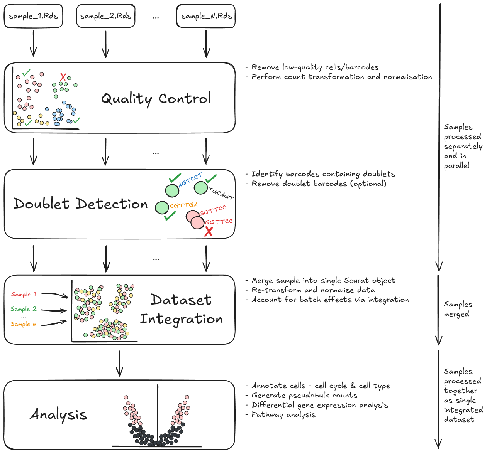
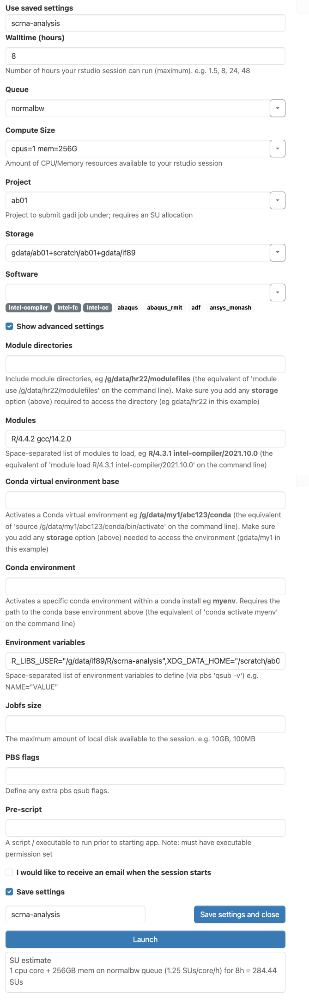
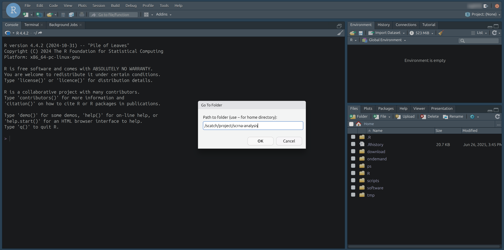

# Single Cell RNA Sequencing Analysis

A series of R notebooks for analysing single cell RNA sequencing data.

## Contents

- [Introduction](#introduction)
- [Workflow structure](#workflow-structure)
    - [Input data](#input-data)
    - [Quality control](#quality-control)
    - [Dataset integration](#dataset-integration)
    - [Analysis](#analysis)
- [How to use the Quarto notebooks](#how-to-use-the-quarto-notebooks)
    - [Platform](#platform)
    - [Rendering documents](#rendering-documents)
- [Installation](#installation)
    - [Installation on NCI](#installation-on-nci)
- [Running on ARE](#running-on-are)

## Introduction

This collection of R notebooks has been designed to guide you through processing and analysing your single cell RNA (scRNA) sequencing data. They are designed to be worked through in the following order:

1. Quality control
2. Doublet detection
3. Dataset integration
4. Differential gene expression and pathway enrichment analyses.

Each notebook explains what is happening in each step, complete with code and rationales for the choices we have made in our approach.

It is important to note there is no one single way to pre-process scRNA data - there are as many ways as there are different software packages and libraries for scRNA analysis, and the limitless ways to use each of their tools and functions.

The workflow presented in these notebooks is the synthesis of best practices, studies, and discussions of how to analyse scRNA data with a focus on using Seurat in R. Footnotes and external links accompany the text throughout the document - please view these for useful additional information and rationale on why steps are done in certain ways.

This content primarily uses the Seurat R package, but the way and order things are run differs vastly from their tutorials. We like to note that the Satija lab Seurat tutorials are instructions on how to use the package, but not how to conduct robust scRNA pre-processing and analysis. This content leverages the flexibility of the Seurat package, but is supplemented by the practices outlined in existing resources. These resources are the most influential:

-   [Current best practices in single-cell RNA-seq analysis: a tutorial (Luecken and Theis, 2019)](https://www.embopress.org/doi/full/10.15252/msb.20188746)
-   [scRNAseq analysis in R with Seurat (Williams and Perlaza, 2024)](https://swbioinf.github.io/scRNAseqInR_Doco/)
-   [Spatial Sampler (Williams, 2025)](https://swbioinf.github.io/spatialsnippets/)

## Workflow structure

The workflow is split into four sections: quality control, doublet detection, dataset integration, and analysis:



### Input data

This workflow has been designed to be run after initial pre-processing with the [`nf-core/scrnaseq`](https://github.com/nf-core/scrnaseq/) Nextflow pipeline. That pipeline takes the raw sequencing data and performs genome alignment and counting of reads/UMIs per gene and per cell. The output of the `nf-core/scrnaseq` pipeline is one R data file (`.Rds`) per sample containing a Seurat data object that holds the sample's count matrix and related metadata. Your data must be in this format to begin working through these notebooks.

### Quality control

The first notebook in this workflow takes the input `.Rds` files containing your pre-processed Seurat data - one file per sample - and performs some basic quality control analyses to detect and remove low quality cells. This is an interactive process where you will be required to select thresholds for filtering. The notebook includes some interactive plots and figures to help guide your decisions in this process. We also perform initial normalisation and transformation of your count data to account for library size differences between samples.

The output from this first stage is a new series of `.Rds` files - again, one per sample - containing your filtered data.

### Doublet detection

The second notebook takes the output files from the quality control notebook and works through identifying doublets in your data. The cell capture process for single cell sequencing is not perfect and can result in multiple cells being captured together and given the same cellular barcode. This typically only affects a small proportion of the cell barcodes, and methods are available to detect these **doublet** and **multiplet** barcodes. In this notebook, we use the R library `DoubletFinder` for this purpose. By default, we remove these doublets from your data, as they will confound your results, although we give you the option of leaving them in and simply having them annotated as such.

The output from this stage is another series of `.Rds` files containing the doublet-free (or doublet-annotated) data - one file per sample.

### Dataset integration

The third notebook in this workflow takes the output of the doublet detection stage and performs dataset integration. This is a vital step that merges your data into a single object and helps to account for batch effects between samples. Without this step, you may find that cells will form clusters based solely on the sample they are from rather than by true biological differences. These batch effects will confound your analyses and make interpretation of results difficult or impossible.

In addition, this notebook works through a final round of data transformation and normalisation, followed by dimensionality reduction and cell clustering. These normalised data and clusters will be used in all downstream analyses.

The output from this stage is a single `.Rds` file containing the merged and integrated Seurat dataset. All downstream analyses will be performed on this single dataset.

### Analysis

The fourth notebook in this workflow takes the merged, integrated, and normalised data from the previous notebook and performs several analyses.

First, we annotate cells by cell cycle and cell type using public databases. We also provide you with an opportunity to supply curated marker gene lists for cell types that you are interested in, which we use to score and annotate your cells with.

After annotation, we perform pseudobulking, which sums together the counts from all cells within a cluster and treats the cluster like a single sample in a bulk RNA sequencing analysis. This has some important advantages, primarily allowing us to use existing bulk RNA sequencing tools and simpler, higher-powered statistical tests for analysing your data.

The pseudobulked data is then used to perform differential gene expression analysis and pathway enrichment analysis.

The outputs from this notebook are:

- An `.Rds` file containing your annotated single cell data
- An `.Rds` file containing your pseudobulked data
- A collection of web reports summarising the pathway enrichment analyses.

## How to use the Quarto notebooks

The notebooks are written in the Quarto format - a format very closely related to R markdown. This format allows code to be interspersed with human-friendly text that explains what we are doing at each step. It also allows you to generate a styled HTML document at the end to save a record of the analyses you have run.

We recommend using [RStudio](https://posit.co/download/rstudio-desktop/) to run each notebook within the [notebooks/](notebooks/) directory.

Each chunk must be run sequentially. This ensures reproducibility and that objects saved in your R environment do not get mixed up.

At the end of each notebook, we also recommend restarting your R session to clear large objects from the workspace.

Some chunks will require your input for setting parameters that will be unique to your data.

At other points, we will generate template files within the [inputs/](inputs/) directory that you will need to edit in order to proceed.

In both cases, the notebooks will highlight what is required.

### Platform

Single cell sequencing data is typically quite large, and processing more than a handful of samples can quickly require more computing resources than your typical laptop or desktop computer will have.

While these notebooks will work on your local computer, we have designed them with high-performance computing environments in mind. We recommend using a cloud- or HPC-hosted RStudio server to run these notebooks. We have tested the notebooks successfully on NCI's Australian Research Environment (ARE) - a web-based interface to the Gadi HPC, with the ability to run an RStudio server with the resources necessary to process large numbers of samples together.

As a consequence, we also only recommend running on Unix-like systems (e.g. Linux and Mac). These notebooks are untested on Windows and may not work as expected on that platform. Most HPC- and cloud-based environments are based on Linux and as such these notebooks will run well on these platforms.

### Rendering documents

Once you have run through all of the notebooks, you can render ("Knit") everything into a human-friendly HTML document. You can do this by running the following command in a terminal, within the top-level project directory:

```{bash}
quarto render
```

When rendering, the notebooks will avoid running expensive operations and will instead use the saved data objects created when running the notebooks interactively. This ensures that they render quickly and efficiently.

## Installation

These notebooks are based on the R programming language and use a number of bioinformatics R packages, in particular Seurat for single cell sequencing analysis. We have provided an R script in this repository at `install/install.R` which will install all the required packages.

### Installation on NCI

The notebooks are intended to be run on NCI's Australian Research Environment (ARE) platform, as this provides a way of running a web-based interactive R session on a high-performance computing system using an RStudio server. However, installing the required R packages on this system can be a little tricky, so we have also provided a bash script for installing on this platform - `install/install_nci.sh`. To use this script, you will first need to log into NCI's gadi:

```bash
# Replace "user" with your NCI username
ssh user@gadi.nci.org.au
```

Next, clone this repository to a convenient location. This will also be where you will be running the notebooks, so it is a good idea to choose a location with a large amount of storage space. We recommend using the `scratch` filesystem as a temporary location for running these notebooks.

```bash
# Replace "project" with your NCI project code
# or choose another location
cd /scratch/project/

git clone https://github.com/Sydney-Informatics-Hub/scrna-analysis.git

cd scrna-analysis/install
```

The installation script can be run interactively on the login node with the following command:

```bash
./install_nci.sh
```

By default, it will perform a dry run of the installation by telling you where the R libraries will be installed. It will also print out the `R_LIBS_USER` environment variable definition you will need to use later on to run the notebooks (see [Running on ARE](#running-on-are) below). The command to set this will also be saved in a new file called `install/setenv.sh`.

```console
R libraries will be installed to the following path:

/g/data/project/R/scrna-analysis/4.4

When running the notebooks, you will need to set the R_LIBS_USER environment variable to this path:

R_LIBS_USER=/g/data/project/R/scrna-analysis/4.4

*** DRY RUN ONLY ***
To submit the installation job to the cluster, run this script again with the --submit flag, or run the following command:

qsub -P project -l storage=gdata/project+scratch/project -v PREFIX='/g/data/project' install_nci.submit.sh
```

```bash
cat setenv.sh
```

```console
R_LIBS_USER=/g/data/project/R/scrna-analysis/4.4
```

Note that by default, the installation path will be `/g/data/project/R/scrna-analysis/4.4`, where `project` is your default NCI project code. You can override the project by using the `--project` parameter:

```bash
./install_nci.sh --project ab01
```

```console
R libraries will be installed to the following path:

/g/data/ab01/R/scrna-analysis/4.4

When running the notebooks, you will need to set the R_LIBS_USER environment variable to this path:

R_LIBS_USER=/g/data/project/R/scrna-analysis/4.4

*** DRY RUN ONLY ***
To submit the installation job to the cluster, run this script again with the --submit flag, or run the following command:

qsub -P ab01 -l storage=gdata/ab01+scratch/ab01 -v PREFIX='/g/data/ab01' install_nci.submit.sh
```

You can also select a different installation prefix with the `--prefix` parameter. The installation path will always be `${PREFIX}/R/scrna-analysis/4.4`:

```bash
./install_nci.sh --project ab01 --prefix /scratch/ab01
```

```console
R libraries will be installed to the following path:

/scratch/ab01/R/scrna-analysis/4.4

When running the notebooks, you will need to set the R_LIBS_USER environment variable to this path:

R_LIBS_USER=/scratch/ab01/R/scrna-analysis/4.4

*** DRY RUN ONLY ***
To submit the installation job to the cluster, run this script again with the --submit flag, or run the following command:

qsub -P ab01 -l storage=gdata/ab01+scratch/ab01 -v PREFIX='/scratch/ab01' install_nci.submit.sh
```

Once you are ready to submit the installation job to the cluster, add the `--submit` flag:

```bash
./install_nci.sh --project ab01 --prefix /scratch/ab01 --submit
```

The installation process may take ~2h to complete. Once finished, inspect the output logs to ensure all packages were correctly installed.

## Running on ARE

Here we provide step-by-step instructions for specifically running these notebooks on NCI's ARE platform. This assumes you have already installed all the required R packages and cloned the repository to a convenient location on Gadi by following the instructions above in [Installation on NCI](#installation-on-nci).

First, in a web browser, navigate to [are.nci.org.au](https://are.nci.org.au). Follow the prompts to log in using your NCI credentials.

On the main ARE dashboard, under "All Apps", select "RStudio". Do not select "RStudio (Rocker image)", as this is an older version of the RStudio app and isn't supported by these notebooks.


On the new page that appears, you will be presented with a number of parameters to configure for your RStudio session. There is also a checkbox labelled "Show advanced settings", **which you will need to select**.

Use the table below to fill in the required parameters. If you don't see the input box for the parameter, ensure you have selected "Show advanced settings" first.

| parameter | value | notes |
| --------- | ----- | ----- |
| Walltime (hours) | 4 | It is better to request more than you will need as you won't be charged for time that isn't used. |
| Queue | normalbw |  |
| Compute Size | large | Some of the steps in these notebooks require a lot of resources, so we recommend using the large compute size. If you run into memory issues, increasing to a larger compute size should help. |
| Project | Your NCI project code |  |
| Storage | gdata/project+scratch/project | Replace `project` with your NCI project code |
| Modules | R/4.4.2 gcc/14.2.0 | These notebooks are based on R version 4.4.2. They also require the `gcc` version 14.2.0 module to be loaded. |
| Environment variables | R_LIBS_USER="/g/data/project/R/scrna-analysis/4.4" | **IMPORTANT:** This value will vary depending on your NCI project code and how you ran `install/install_nci.sh`. Use the command that was saved inside `install/setenv.sh` when you ran the installation script (see [Installation on NCI](#installation-on-nci) above). This value tells R where to find all the required packages for these notebooks. The value shown in this table is the default, where `project` should be replaced with your default NCI project code. |

Your settings should look something like this:



We recommend saving your settings so that you can quickly start a new session in the future. At the bottom of the page, click the checkbox labelled "Save settings". In the box below that, type a name for your saved settings and click "Save settings and close". This will take you to a new page with a list of your saved settings. At the top right of this list is a play button arrow. Click this to launch a new session of RStudio with your saved settings.


You will be brought to a new page that shows the status of your session. It will start out as "Queued", but within a few minutes it should show the status as "Starting" and then "Running". Once running, a button will appear labelled "Connect to RStudio Server". Click this to open RStudio in a new browser tab.


Within RStudio, you can use the file browser at the lower right side to navigate to where you cloned the repository and start working through the notebooks.





You can access your saved settings anytime by going to the [My Interactive Sessions](https://are.nci.org.au/pun/sys/dashboard/batch_connect/sessions) page in the ARE dashboard. Under "Saved Settings" you should see the name you gave your settings. Clicking this link brings you back to the page where you can launch your session.


